# Memoria Dinamica

Se almacena en la memoria de forma dinámica, es decir, se reserva espacio en la memoria para almacenar datos en tiempo de ejecución. Esto permite crear estructuras de datos que pueden crecer o decrecer según sea necesario. 

## Heap

El puntero que vamos a usar como referencia sera la letra H.

### Ejemplo Declaracion

```cpp
Struct rectangulo{
    int base;
    int altura;
};

void main(){
    rectangulo r1;
    rectangulo r2;
}
```

r1 y r2 son variables del tipo locales, por lo que se almacenan en la pila (Stack).


### Ejemplo Instanciacion

```cpp
Struct rectangulo{
    int base;
    int altura;
};

void main(){
    rectangulo r1 = new rectangulo;
    rectangulo r2 = new rectangulo;
}
```
Al instanciar r1 y r2, se almacenan en el heap. En este caso, la memoria se reserva en tiempo de ejecución. En el heap r1 y r2 tiene 2 espacios uno para base y otro para altura.

En este punto el heap va a almacenar 2 direcciones de memoria que apuntan al Heap. 


### Ejemplo Grafico


```
Struct rectangulo{
    int base;
    int altura;
};

void  arear( int base, int altura){
    rectangulo r1 = new rectangulo;
    r1.base = base;
    r1.altura = altura;
    Printf("El area es: ", r1.base * r1.altura);
}

void main(){
    int x, y;
    x = 5;
    y = 2;
    arear(x, y);
}
```

C3D

```c3d
proc arear(){
    t1 = P + 2
    stack[t1] = H
    H = H + 2 // rectangulo r = new rectangulo() -> Guardar en R la direccion del Heap

    t2 = P + 2
    t3 = stack[t2] // t3 = 0 posicion del rectangulo
    t4 = t3 + 0 // base "Puntero del Heap"
    t5 = P + 0 // Variable x
    t6 = stack[t5] // t6 = 5 base
    heap[t4] = t6 // Guardar el valor de x en la base del rectangulo

    t7 = P + 2
    t8 = stack[t7] // t8 = 0 posicion del rectangulo
    t9 = t8 + 1 // altura "Puntero del Heap"
    t10 = P + 1 // Variable y
    t11 = stack[t10] // t11 = 2 altura
    heap[t9] = t11 // Guardar el valor de y en la altura del rectangulo

    t12 = P + 2 
    t13 = stack[t12] // t13 = 0 posicion del rectangulo
    t14 = t13 + 0 // base "Puntero del Heap"
    t15 = heap[t14] // t15 = 5 base

    t16 = P + 2
    t17 = stack[t16] // t17 = 0 posicion del rectangulo
    t18 = t17 + 1 // altura "Puntero del Heap"
    t19 = heap[t18] // t19 = 2 altura

    t20 = t15 * t19 // Area

    Write(t20) // Imprimir el area
}

proc main(){
    t21 = P + 0 // Variable x
    stack[t21] = 5 // Guardar el valor de x en la pila

    t22 = P + 1 // Variable y
    stack[t22] = 2 // Guardar el valor de y en la pila

    t23 = P + 0 // Variable x
    t24 = stack[t23] // t24 = 5 base
    t25 = P + 2 // Cambio de entorno
    t26 = t25 + 0 // t26 Como nuevo puntero de la pila apunta a la posicion 0 (base)
    stack[t26] = t24 // Guardar el valor de x en la pila

    t27 = P + 1 // Variable y
    t28 = stack[t27] // t28 = 2 altura
    t29 = P + 2 // Cambio de entorno
    t30 = t29 + 1 // t30 Como nuevo puntero de la pila apunta a la posicion 1 (altura)
    stack[t30] = t28 // Guardar el valor de y en la pila

    P = P + 2 // Cambiar el puntero de la pila a la posicion 2 (arear)

    arear() // Llamar a la funcion arear

    P = P - 2 // Cambiar el puntero de la pila a la posicion 0 (main)
}


```


# Comprobacion de tipos 

Existen dos tipos de comprobacion de tipos:
1. **Estatica**: Se realiza en tiempo de compilacion. Se verifica que los tipos de datos sean compatibles entre si.
2. **Dinamica**: Se realiza en tiempo de ejecucion. Se verifica que los tipos de datos sean compatibles entre si en tiempo de ejecucion.

## Comprobacion de tipos estaticos

### Comprobacionde tipos
- Flujo de control (break, continue, return)
- Comprobacion de unicidad (Tabla de simbolos)

### La base de comprobacion estatica
- Tabla de simbolos
- Traduccion Dirigida por la Sintaxis

## Estrategia de imlementacion

Traduccion dirigida por la sintaxis
- Comprobacion Estatica // Verificacion de tipos adecuados para entoces si seguir a la siguiente fase
- Generacion de C3D

## Sistema de tipos
- Conjunto de reglas que define como un lenguaje de programacion organiza y clasifica los valores y las expresiones en los tipos de datos.
- Como pueden manipular estos tipos y como interactuan entre si.
- Tipos de datos primitivos: enteros, flotantes, booleanos, caracteres, cadenas de texto, error_tipo, vacio.

## Expresion de tipos
- Cada parte del programa tiene un tipo de dato asociado.
    - Expresiones:
        - Expresion aritmetica
        - Expresion relacional
        - Expresion booleanas  
        
        

    - Proposiciones
        - Asignaciones
        - Flujos de control
        
        

# Optimizacion
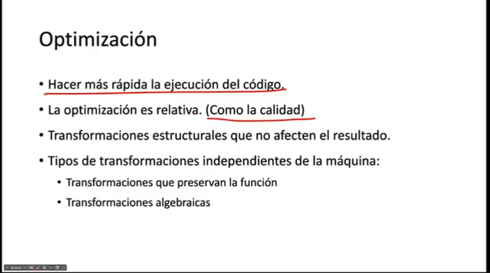

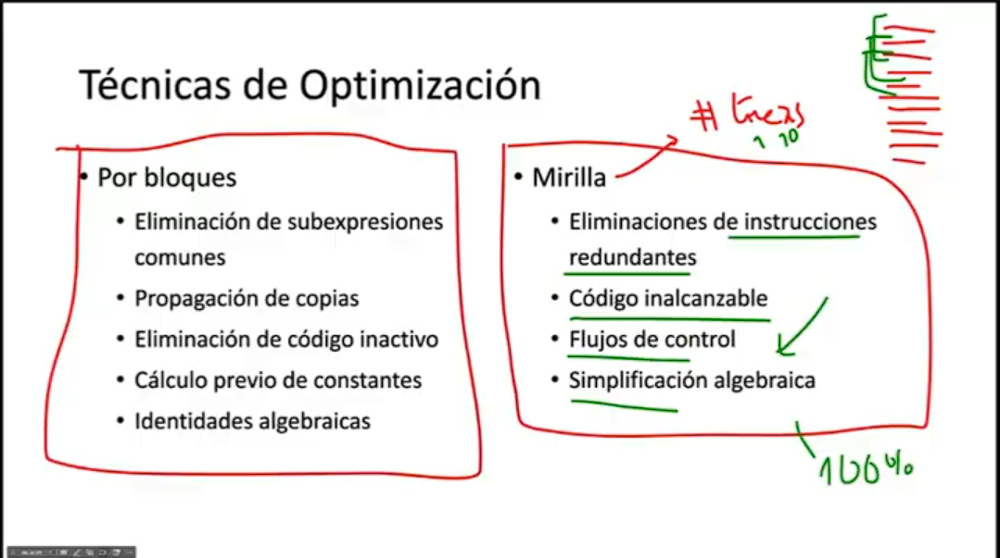


## Optimizacion Por Bloques
- Bloque Basico: Secuencia de instrucciones que no contiene saltos ni etiquetas.

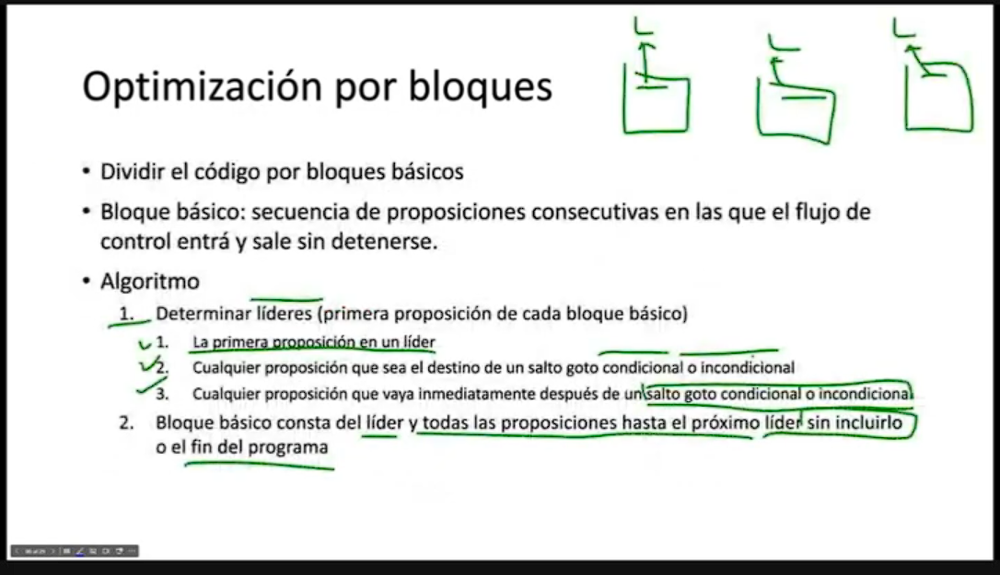  

Algoritmo:
- Determinar lideres de bloques
    - La primera proposicion es un lider
    - Cualquier proposicion que sea el destino de un salto goto condicional o incondicional es un lider
    - Cualquier proposicion que vaya inmediatamente despues de un salto goto incondicional es un lider

- Bloque basico consta del lider y todas las proposiciones hasta el proximo lider sin incluirlo o el fin del programa.

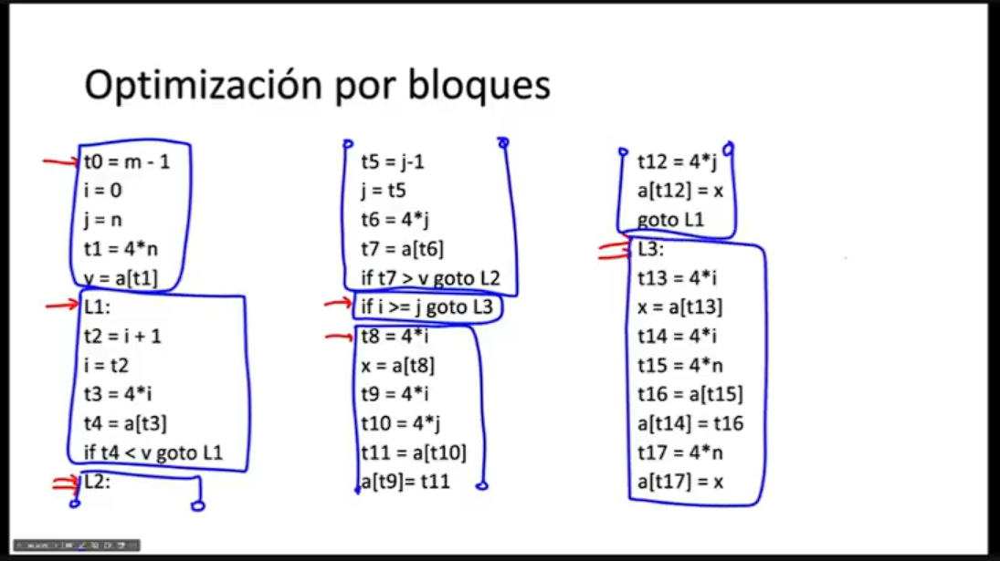
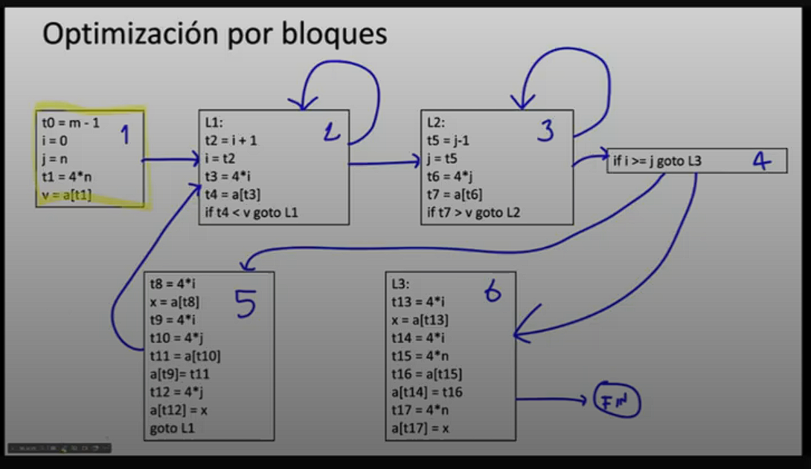


### Eliminacion de subexpresiones comunes
Se considera una subexpresion comun (E), si esta ha sido calculada previamente y los valores de las variables no han cambiado desde el calculo anterior.

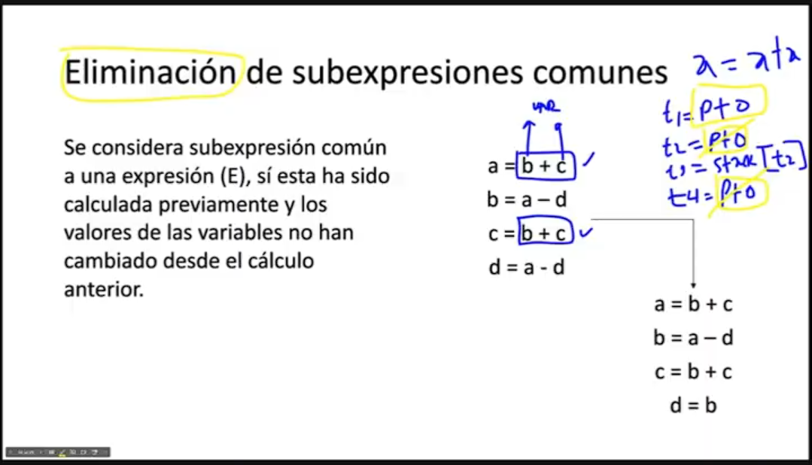

## Propagacion de copias 
- Asignaciones de la forma x = y (Proposiciones copia)

- El algoritmo de eliminacion de subexpresiones comunes las introduce 

- La idea es utilizar y por x, siempre y cuando sea posible despues de la proposicion de copia x = y.

- A menudo convierte porposiciones de copia en codigo inactivo.

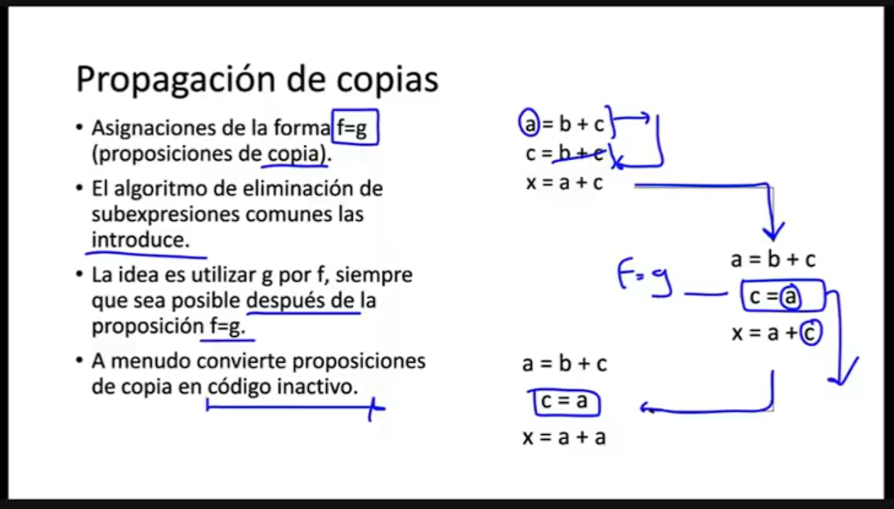


## Eliminacion de codigo inactivo

- Una variable esta activa en un punto si su valor puede ser utilizado posteriormente, en caso contrario esta incativa en ese punto.

- Proposiciones que nunca llegan a utilizarse.

- Puede aparecer como resultado de transformaciones de anteriores.


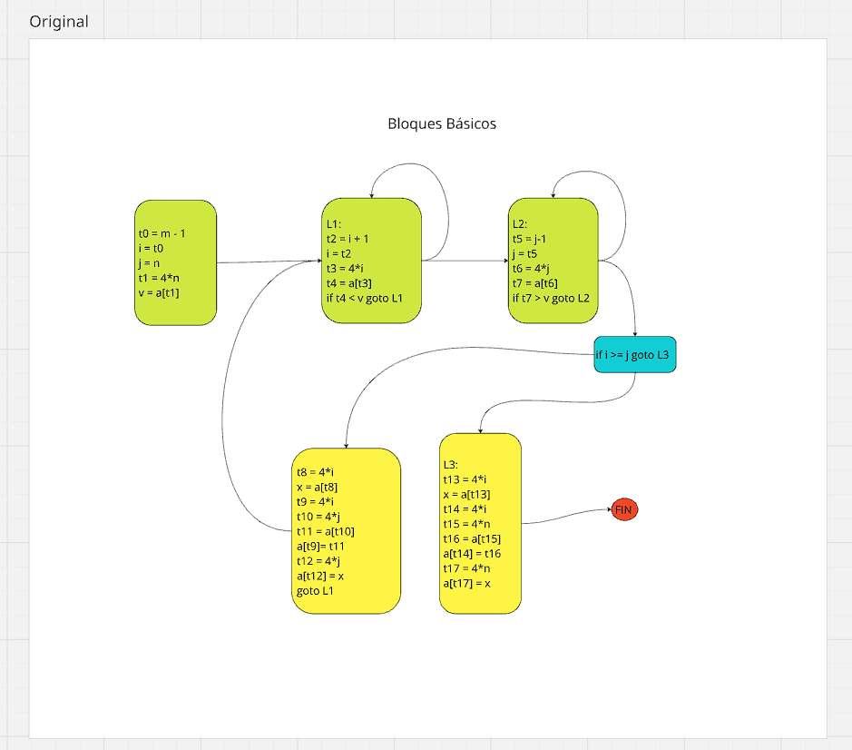

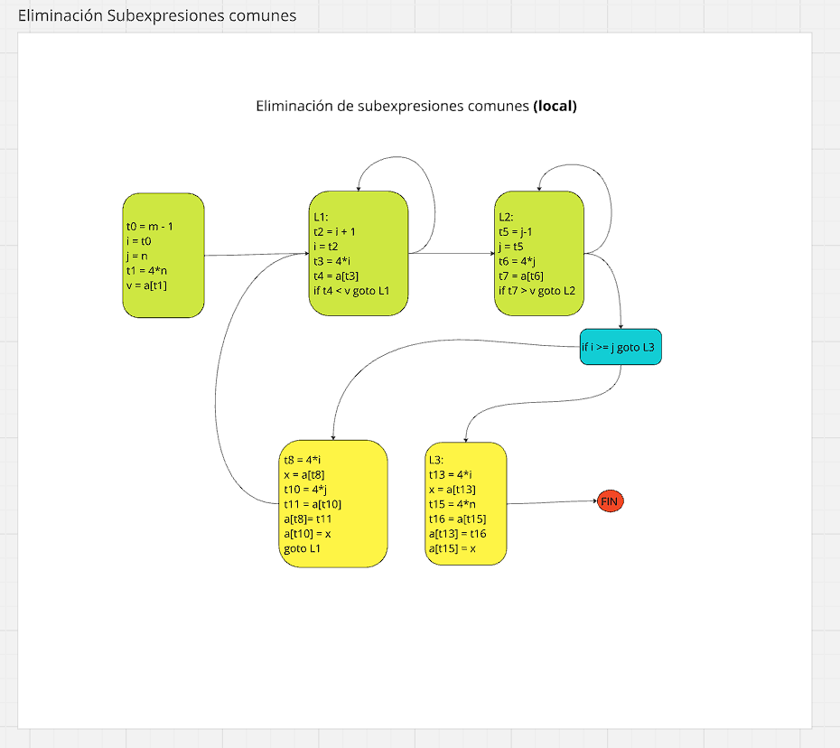

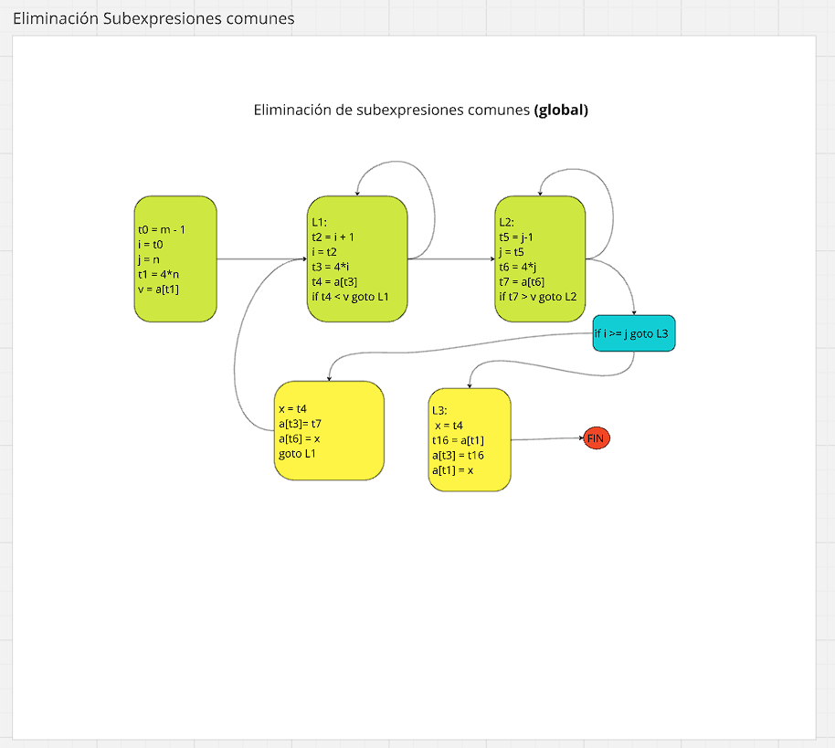

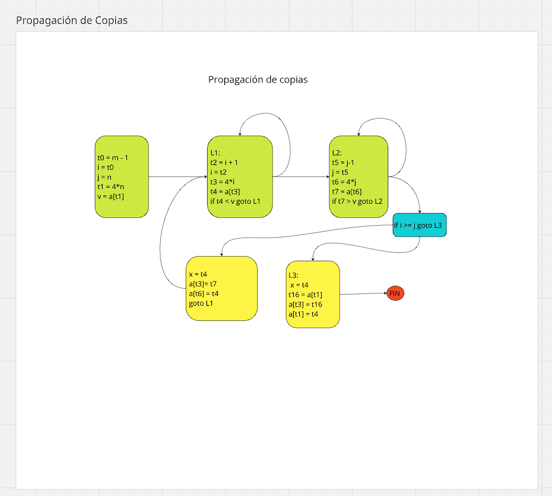

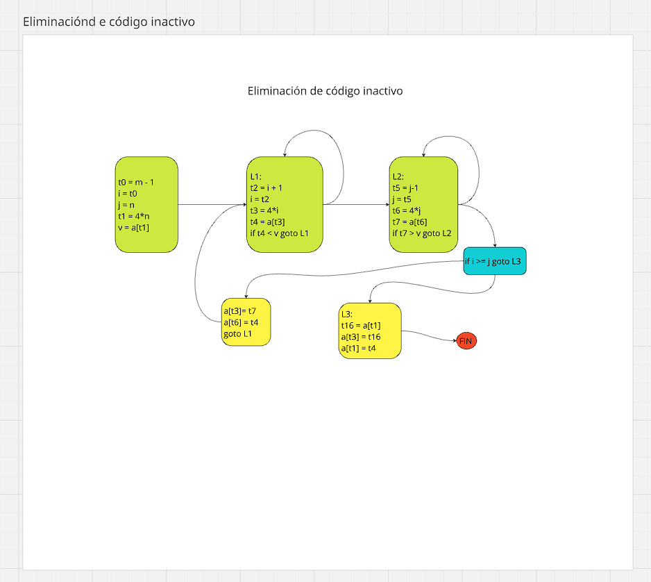


# ALGORITMO EXAMEN FINAL 

Void MultiplicarMatrices()
    // Definir arrays enteros con rangos específicos
    Definir A[1..3][2..4], B[2..4][8..10], C[1..3][8..10]
    Definir enteros: i, j, k
    
    // Multiplicar matrices
    i ← 1
    mientras i ≤ 3 hacer
        j ← 8
        mientras j ≤ 10 hacer
            k ← 2
            mientras k ≤ 4 hacer
                C[i][j] ← C[i][j] + A[i][k] * B[k][j]
                k ← k + 1
            fin mientras
            j ← j + 1
        fin mientras
        i ← i + 1
    fin mientras
    
    // Imprimir resultado
    // Nota: Los índices originales M y P no estaban definidos,
    // así que usaré los límites específicos de C
    i ← 1
    mientras i ≤ 3 hacer
        j ← 8
        mientras j ≤ 10 hacer
            Escribir C[i][j]
            j ← j + 1
        fin mientras
        i ← i + 1
    fin mientras

    