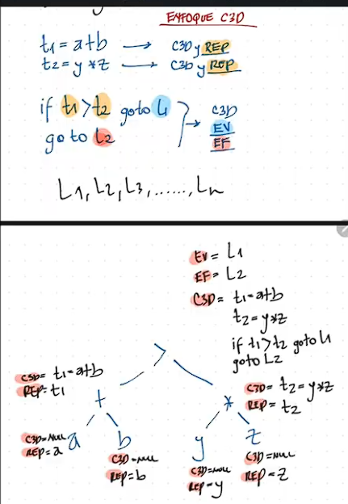
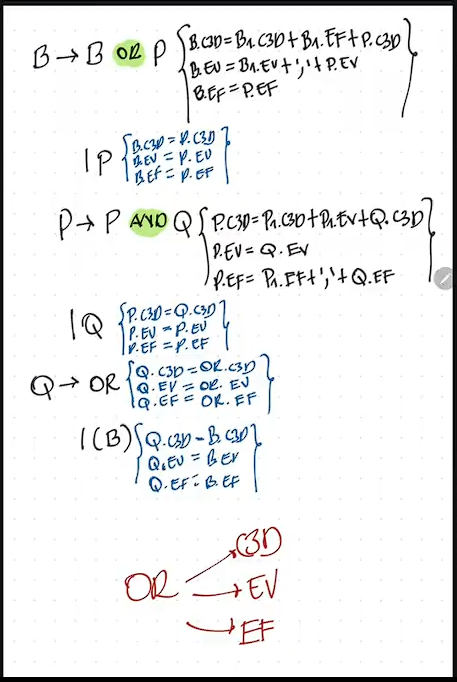

# Como simplificar el C3D
## Utilizar los temporales para simplificar el código en trios
x and y and z or w or p
t1 = x and y

t1 and z or w or p
t2 = t1 and z

t2 or w or p
t3 = t2 or w

t3 or p

t4 = t3 or p

t4
# INSTRUCCIONES 
### 1. x = y
### 2. x = y op z
### 3. goto Lx
### 4. if x oprel y, goto Lx
### 5. call x;
### 6. x = y[i]     x[i] = y
#### Una operacion Aritmetica contiene 2 elementos, C3D y Un Representante
#### Una Operacion Relacional / Booleana contiene 3 elementos, C3D, Etiqueta Verdadera y Etiqueta Falsa

# Expresiones Aritméticas
```
a + b 
t1 = a + b
```
```
a * b
t1 = a * b
```
```
a * b + c
t1 = a * b
t2 = t1 + c
```
```
a + b * c * d
t1 = b * c
t2 = t1 * d
t3 = a + t2
```
```
a + (b * c) + d
t1 = b * c
t2 = a + t1
t3 = t2 + d
```
```
a
a
```
# Traducción Dirigida por la Sintaxis (TDS)
```
a + b * c * d
    t1 = b * c
    t2 = t1 * d
    t3 = a + t2
```

```
S -> E {Print(E.c3d)}

E -> E + T {
        E.rep = getTemp()
        E.c3d = E1.c3d + T.c3d +
                E.rep + "=" + E1.rep + "+" + T.rep
}
    | T {E.rep = T.rep
        E.c3d = T.c3d
}

T -> T * F {
        T.rep = getTemp()
        T.c3d = t1.c3d + F.c3d +
                T.rep + "=" + T1.rep + "*" + F.rep
}
    | F {T.rep = F.rep
        T.c3d = F.c3d
}


F -> id {F.rep = id
        F.c3d = null
}
    | (E) {F.rep = E.rep
            F.c3d = E.c3d
}
```
# Operaciones Relacionales
### >, <, >=, <=, ==, !=  (OPREL)
```
a > b
if a > b goto L1
goto L2
```
```
a == b
if a == b goto L1
goto L2
```
```
a <= b
if a <= b goto L1
goto L2
```
```
a != b
if a != b goto L1
goto L2
```
```
(a + b) * c > x - y * z
t1 = a + b
t2 = t1 * c 
t3 = y * z
t4 = x - t3
if t2 > t4 goto L1
goto L2
```
```
a > (x - y) * z
t1 = x - y
t2 = t1 * z
if a > t2 goto L1
goto L2

a + b > b * c
t1 = a + b
t2 = b * c
if t1 > t2 goto L1
goto L2
```
- este codigo me va a generar C3D y Etiquetas V y F

```
Or -> E opRel E { Or.ev = getLabel()
                  Or.ef = getLabel()
                    Or.c3d = E1.c3d + E2.c3d +
                    if E1.rep opRel E2.rep goto Or.ev
                    goto Or.ef
}
Oprel -> > | < | >= | <= | == | !=
```
# Operaciones Booleanas / Lógicas
### and, or, not

#### and
```
a > b and c < d
if a > b goto L1
goto L2
L1:
if c < d goto L3
goto L4

Etiquetas V y F
V: L3
F: L2, L4
```
#### or
```
a > b or c < d
if a > b goto L1
goto L2
L2:
if c < d goto L3
goto L4

Etiquetas V y F
V: L1, L3
F: L4
```
```
a + b > x * y AND (a + b) * z < x
t1 = a + b
t2 = x * y
if t1 > t2 goto L1
goto L2
L1:
t4 = a + b
t5 = t4 * z
if t5 < x goto L3
goto L4

Etiquetas V y F
V: L3
F: L2, L4
```
#### not
```
not a > b
if a > b goto L2
goto L1

Etiquetas V y F
V: L1
F: L2
```

```
Not( a > b and c < d)
if a > b goto L1
goto L2
L1:
if c < d goto L3
goto L4

Etiquetas V y F
V: L2, L4
F: L3
```

# Combinación de Operaciones Relacionales y Booleanas
```
x > y OR p == q AND a != b
if x>y goto L1:
goto L2:
L2:
    if p==q goto L3:
    goto L4:
    L3:
    if a!=b goto L5:
    goto L6:

Etiquetas V y F
V: L1, L5 
F: L4, L6
```

```
B -> B or P{
        B.c3d = B1.c3d + B1.F + P.c3d
        B.V = B1.V + "," + P.V
        B.F = P.F
}
    | P {
        B.c3d = P.c3d
        B.V = P.V
        B.F = P.F
    }

P -> P and Q {
        P.c3d = P1.c3d + P1.V + Q.c3d
        P.V = Q.V
        P.F = P.F + "," + Q.F
}
    | Q{
        P.c3d = Q.c3d
        P.V = Q.V
        P.F = Q.F
    }

Q -> OpRel {
    Q.c3d = OpRel.c3d
    Q.V = OpRel.V
    Q.F = OpRel.F
}
    | (B)
```




# Flujos de Control
### if, if-else, if-else-if
#### if

Alto nivel
```
if a > b {
    a = a+b
}
```
C3D
```
if a > b goto L1
goto L2
L1:
t1 = a + b
a = t1
L2:
```


```
if x > y {
    if p == q {
        if a < b {
            x = a+b
        }
    }
}
```
```
if x > y goto L1
goto L2
    L1:
    if p == q goto L3
    goto L4
        L3:
        if a < b goto L5
        goto L6
            L5:
            t1 = a + b
            x = t1
            L6:
        L4:
    L2:
```
#### if-else
```
if a > b {
    a = a+b
} else {
    a = a-b
}
```
```
if a > b goto L1
goto L2
    L1:
    t1 = a + b
    a = t1
    goto L3
    L2:
    t2 = a - b
    a = t2
    L3:
```


#### if-else-if
```
if a > b {
    a = a+1
} else if x > y {
    x = x+1
} else {
    a = b+1
}
```
```
if a > b goto L1
goto L2
    L1:
    t1 = a + 1
    a = t1
    goto L3
    L2:
    if x > y goto L4
    goto L5
        L4:
        t2 = x + 1
        x = t2
        goto L6
        L5:
        t3 = b + 1
        a = t3
    L3:
    L6:
```
### Ciclos
#### while
```
while a > b {
    a = a + 1
}
```
```
L3:
if a > b goto L1
goto L2
    L1:
    t1 = a + 1
    a = t1
    goto L3:
    L2:
```
```
while a > b {
    while x == y {
        while p != q {
            a = x + p
        }
    }
}
```
```
L9:
if a > b goto L1
goto L2
    L1:
    L8:
    if x == y goto L3
    goto L4:
        L3:
        L7:
        if p != q goto L5
        goto L6
            L5:
            t1 = x + p
            a = t1
            goto L7:
        L6:
        goto L8:
    L4:
    goto L9:
L2:
```


#### do-while
```
do {
    a = a + 1
} while a > b
```
```
L1:
    t1 = a + 1
    a = t1
if a > b goto L1
goto L2
    L2:
```
#### Switch
```
switch (x) {
    case 1{
        x = x + 1
    }
    case y{
        x = y + 1
    }
    case z{
        x = z + 1
    }
    default {
        x = x - 1
    }
}
```
Codigo3Direcciones
```
if x == 1 goto L1
goto L2
    L1:
    t1 = x + 1
    x = t1
    goto L3
    L2:
        if x == y goto L4
        goto L5
            L4:
            t2 = y + 1
            x = t2
            goto L6
            L5:
                if x == z goto L7
                goto L8
                    L7:
                    t3 = x + 3
                    x = t3
                    goto L9
                        L8:
                        t4 = x - 1
                        x = t4
                L9:
            L6:
    L3:
```

Gramatica Para Aritmeticas, Relacionales y Booleanas
```
S -> E {Print(E.c3d)}

E -> E + M {
            E.rep = getTemp()
            E.c3d = E1.c3d + M.c3d +
                    E.rep + "=" + E1.rep + "+" + M.rep
}
    | M {
        E.rep = M.rep
        E.c3d = M.c3d
        E.V = M.V
        E.F = M.F
    }

M -> M * R {
            M.rep = getTemp()
            M.c3d = M1.c3d + R.c3d +
                    M.rep + "=" + M1.rep + "*" + R.rep
}
    | R {
        M.rep = R.rep
        M.c3d = R.c3d
        M.V = R.V
        M.F = R.F
    }

R -> R opRel T {
                R.V = getLabel()
                R.F = getLabel()
                R.c3d = R1.c3d + T.c3d +
                    if R1.rep opRel T.rep goto R1.V
                    goto R.F
}
    | T {
        R.rep = T.rep
        R.c3d = T.c3d
        R.V = T.V
        R.F = T.F
    }

T -> T or F {
        T.c3d = T1.c3d + T1.F + F.c3d
        T.V = T1.V + "," + F.V 
        T.F = F.F
}
    | F {
        T.rep = F.rep
        T.c3d = F.c3d
        T.V = F.V
        T.F = F.F
    }

F -> F and G {
        F.c3d = F1.c3d + F1.V + G.c3d
        F.V = G.V
        F.F = F.F + "," + G.F
}
    | G {
        F.rep = G.rep
        F.c3d = G.c3d
    }

G -> not H {
        G.c3d = H.c3d
        G.v = H.F
        G.f = H.V

}

H -> id {
        H.rep = id
        H.c3d = null
        H.V = null
        H.F = null
    }
    | num {
        H.rep = num
        H.c3d = null
        H.V = null
        H.F = null
    }
    | (E) {
        H.rep = E.rep
        H.c3d = E.c3d
        H.V = E.V
        H.F = E.F
    }

opRel -> > | < | >= | <= | == | !=
```


if a > b goto L1
goto L2
    L1:
    if p != q goto L3
    goto L4
        L3:
        L7:
        if a < p goto L5
        goto L6:
            L5:
            t1 = a + 2
            a = t1
            goto L7
        L6:
        
        goto L10
        L2, L4:
            if x > q goto L8:
            goto L9
                L8:
                t2 = x + y
                x = t2
            L9:
        L10: