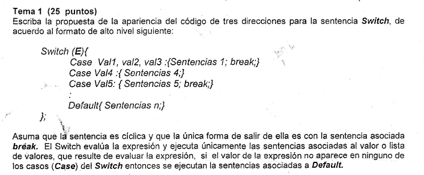
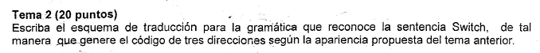
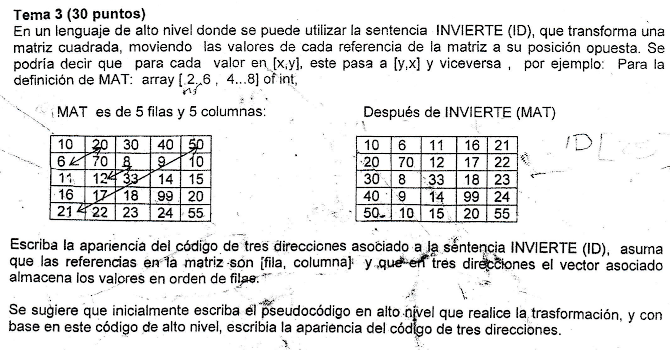
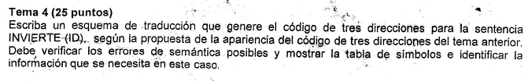
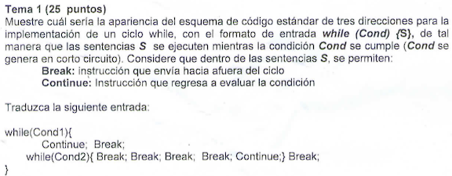
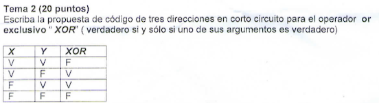
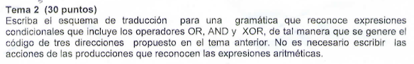
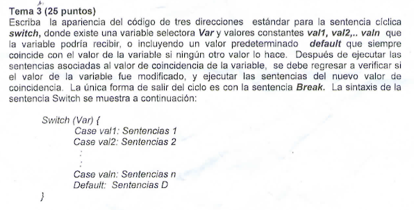

# Examen de Repaso 1

```
if E  == val1 goto L1:
goto L2:
    L1:
        Sentencias 1
        goto L3:
    L2:
    if E == val2 goto L4:
    goto L5:
        L4:
            sentencias 1
            goto L6:
        L5:
        if E == val3 goto L7:
        goto L8:
            L7:
                Sentencias 1
                goto L9:
            L8:
if E == val4 goto L10:
goto L11:
    L10:
        Sentencias 4
    L11:
if E == val5 goto L12:
goto L13:
    L12:
        Sentencias 5
        goto L14:
    L13:
        Sentencias N

L3, L6, L9, L14:
```


Realizando la gramatica para switch case, se tiene que:

```BNF
<switch> ::= switch ( <expresion> ) { <casos> } ;
<casos> ::= <casos> <caso>  
            | <caso>

<caso> ::= case <valores> : { <sentencias> }
        | default : { <sentencias> }

<valores> ::= <valores> , <valor>
            | <valor>

<valor> ::= id
        | numero
        | cadena

<sentencias> ::= <sentencia> break ;
                | <sentencia> ;
                | <sentencia>
```


```
Función INVIERTE(MAT):
    filas = 5
    columnas = 5
    MAT_INVERTIDA = nueva Matriz(filas, columnas)
    i = 0
    j = 0
    mientras (i < filas):
        j = 0 
        mientras (j < columnas):
            MAT_INVERTIDA[j][i] = MAT[i][j]
            j = j + 1  
        i = i + 1
    retornar MAT_INVERTIDA

<!-- Función Principal():
    MAT = [
        [10, 20, 30, 40, 50],
        [6, 70, 8, 9, 10],
        [11, 12, 33, 14, 15],
        [16, 17, 18, 99, 20],
        [21, 22, 23, 24, 55]
    ]
    MAT_RESULTADO = INVIERTE(MAT)
    Imprimir(MAT_RESULTADO) -->

filas = 5
columnas = 5

-- Resolviendo acceso a matriz
t1 = filas - inf1
t2 = t1 * n2
t3 = t2 + columnas
t4 = t3 - inf2

MatInvertida = nuevamatriz[t4]

i = 0
j = 0

-- Resolviendo ciclo while
L3:
if i < filas goto L1:
goto L2:
    L1:
    j = 0
    L6:
    if j < columnas goto L4:
    goto L5:
        L4:
        t5 = j - inf1
        t6 = t5 * n2
        t7 = t6 + i
        t8 = t7 - inf2
        t9 = MAT[t8]
        
        t10 = i - inf1
        t11 = t10 * n2
        t12 = t11 + j
        t13 = t12 - inf2
        t9 = MatInvertida[t13]
        t14 = j + 1
        j = t14
        goto L6:
    L5:
    t15 = i + 1
    i = t15
    goto L3:
L2:
retornar MatInvertida
```



Sepa la bola como es tengo hueva

# Examen de Repaso 2

```
L14:
L3:
if Cond1 goto L1:
goto L2:
    L1:
        goto L3:
        goto L4:
        
        L12:
        L11:
        if Cond2 goto L5:
        goto L6:
        L5:
            goto L7:
            goto L8:
            goto L9:
            goto L10:
            goto L11:
        goto L12:
        L6:
        goto L13:
    goto L14:
L2:
L4, L7, L8, L9, L10, L13:
```

```
if Oprel goto L1:
goto L2:
L1:
    if Oprel goto L3:
    goto L4:
    goto L5:
L2:
    if Oprel goto L6:
    goto L7:
    goto L8:

L5:
Etiquetas Verdaderas: L4
Etiquetas Falsas: L3

L8:
Etiquetas Verdaderas: L6
Etiquetas Falsas: L7
```



```
H -> H Xor T {
        if(H1.V){
            H.c3d = H1.c3d + H1.V + T.c3d
            H.V = T.F
            H.F = T.V
        } else {
            H.c3d = H1.c3d + H1.F + T.c3d
            H.V = T.V
            H.F = T.F 
        }
    } 
    | T{
        H.rep = T.rep
        H.c3d = T.c3d
        H.V = T.V
        H.F = T.F
    }

T -> T or F {
        T.c3d = T1.c3d + T1.F + F.c3d
        T.V = T1.V + "," + F.V 
        T.F = F.F
}
    | F {
        T.rep = F.rep
        T.c3d = F.c3d
        T.V = F.V
        T.F = F.F
    }

F -> F and G {
        F.c3d = F1.c3d + F1.V + G.c3d
        F.V = G.V
        F.F = F.F + "," + G.F
}
    | G {
        F.rep = G.rep
        F.c3d = G.c3d
    }
```

```
switch (x) {
    case 1{
        x = x + 1
    }
    case y{
        x = y + 1
    }
    case z{
        x = z + 1
    }
    default {
        x = x - 1
    }
}
```
Codigo3Direcciones
```
if x == 1 goto L1
goto L2
    L1:
    t1 = x + 1
    x = t1
    goto L3
    L2:
        if x == y goto L4
        goto L5
            L4:
            t2 = y + 1
            x = t2
            goto L6
            L5:
                if x == z goto L7
                goto L8
                    L7:
                    t3 = x + 3
                    x = t3
                    goto L9
                        L8:
                        t4 = x - 1
                        x = t4
                L9:
            L6:
    L3:
```
