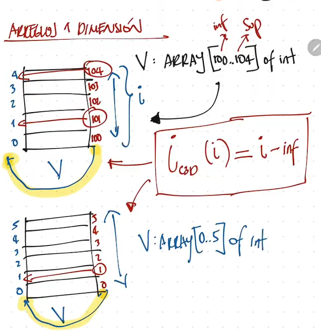
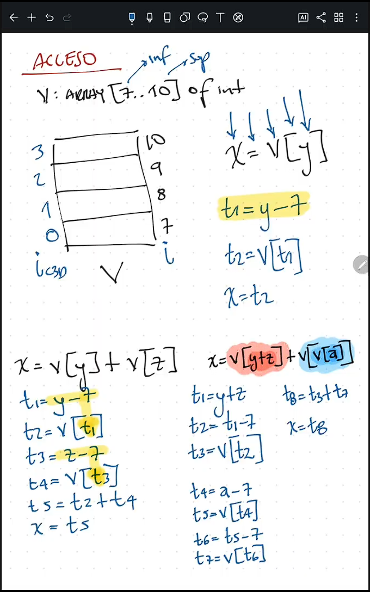
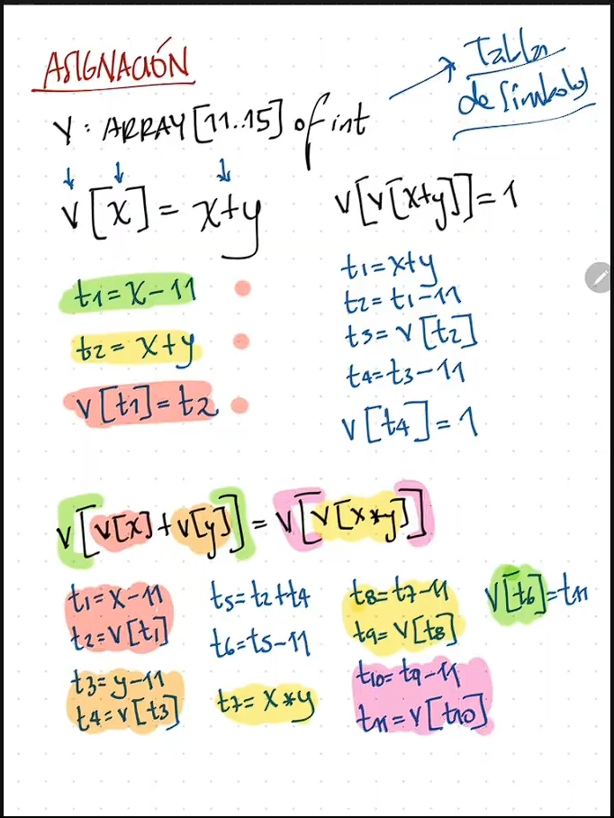

# Arreglos

## Arreglos unidimensionales
### C3D
```c
x = y[i]
x[i] = y
```



### Acceso
#### Pasos
1. Se obtiene la dirección del arreglo.
2. Se obtiene la dirección del elemento.
3. Se obtiene el valor del elemento.

```c
V: ARRAY [7..10] OF INTEGER

! Alto nivel
x = V[y] 

! Bajo nivel
t1 = y - 7
x = V[t1]
```

```c
x = V[y] + V[z]

t1 = y - 7
t2 = V[t1]
t3 = z - 7
t4 = V[t3]
t5 = t2 + t4
x = t5
```

```c
x = V[y+z] + V[V[a]]
t1 = y + z
t2 = t1 - 7
t3 = V[t2]

t4 = a - 7
t5 = V[t4]
t6 = t5 - 7
t7 = V[t6]

t8 = t3 + t7
x = t8
```


### Asignacion
#### Pasos
1. Se obtiene la dirección donde se va a asignar.
2. Se obtiene el valor que se va a asignar.
3. Se hace la asignación.
```c
V: ARRAY [11..15] OF INTEGER

V[x] = x + y

t1 = x - 11
t2 = y + x
V[t1] = t2
```

```c
V[V[x+y]] = 1 

t1 = x + y
t2 = t1 - 11
t3 = V[t2]

t4 = t3 - 11
V[t4] = 1
```

```c
V[ V[x] + V[y] ] = V[V[x*y]]

t1 = x - 11
t2 = V[t1]
t3 = y - 11
t4 = V[t3]
t5 = t2 + t4
t6 = t5 - 11
!V[t6] = V[V[x*y]]

t7 = x * y
t8 = t7 - 11
t9 = V[t8]
t10 = t9 - 11
t11 = V[t10]
V[t6] = t11
```

