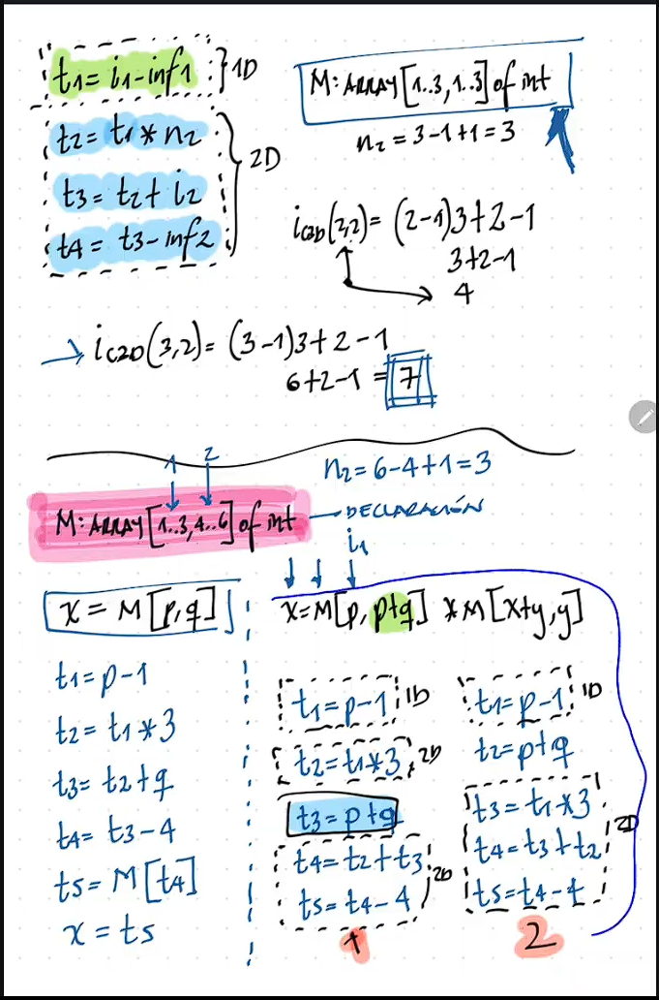
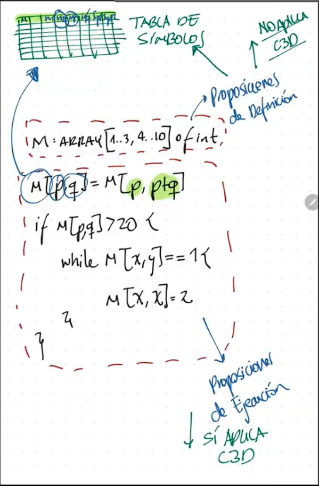
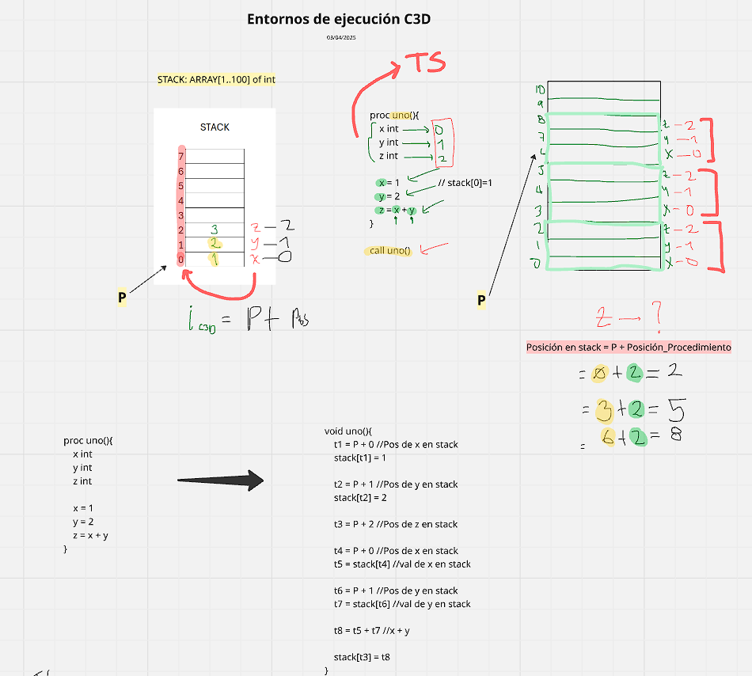
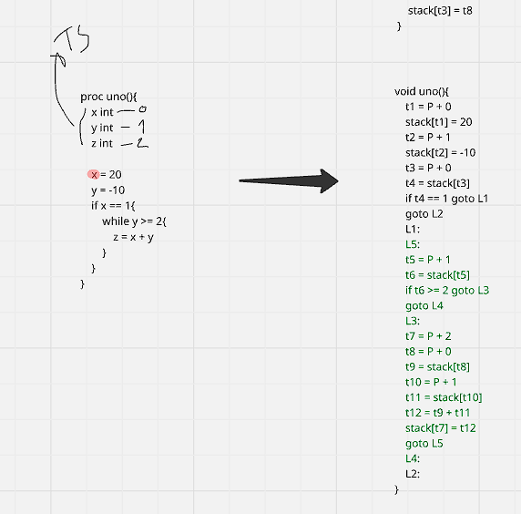
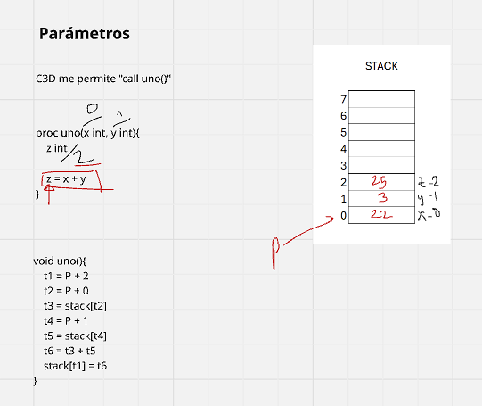

# Arreglos

## Arreglos unidimensionales
### C3D
```c
x = y[i]
x[i] = y
```


### Acceso
#### Pasos
1. Se obtiene la dirección del arreglo.
2. Se obtiene la dirección del elemento.
3. Se obtiene el valor del elemento.

```c
V: ARRAY [7..10] OF INTEGER

! Alto nivel
x = V[y] 

! Bajo nivel
t1 = y - 7
x = V[t1]
```

```c
x = V[y] + V[z]

t1 = y - 7
t2 = V[t1]
t3 = z - 7
t4 = V[t3]
t5 = t2 + t4
x = t5
```

```c
x = V[y+z] + V[V[a]]
t1 = y + z
t2 = t1 - 7
t3 = V[t2]

t4 = a - 7
t5 = V[t4]
t6 = t5 - 7
t7 = V[t6]

t8 = t3 + t7
x = t8
```


### Asignacion
#### Pasos
1. Se obtiene la dirección donde se va a asignar.
2. Se obtiene el valor que se va a asignar.
3. Se hace la asignación.
```c
V: ARRAY [11..15] OF INTEGER

V[x] = x + y

t1 = x - 11
t2 = y + x
V[t1] = t2
```

```c
V[V[x+y]] = 1 

t1 = x + y
t2 = t1 - 11
t3 = V[t2]

t4 = t3 - 11
V[t4] = 1
```

```c
V[ V[x] + V[y] ] = V[V[x*y]]

t1 = x - 11
t2 = V[t1]
t3 = y - 11
t4 = V[t3]
t5 = t2 + t4
t6 = t5 - 11
!V[t6] = V[V[x*y]]

t7 = x * y
t8 = t7 - 11
t9 = V[t8]
t10 = t9 - 11
t11 = V[t10]
V[t6] = t11
```


## Arreglos Bidimensionales
### C3D
```c
x = y[i, j]
x[i, j] = y
```


### Acceso

M: Array [1..3, 4..6] of Integer
x = M[p, q]
```c
t1 = p - 1
t2 = t1 * 3
t3 = t2 + q
t4 = t3 - 4
t5 = M[t4]
x = t5
```

x = M[p, p + q] 
#### Propuesta1 (No utilizada)
```c
t1 = p - 1 ! Primera Dimension
t2 = t1 * 3 !Primera parte - Segunda Dimension

t3 = p + q ! Resolviendo previo a Segunda Dimension

t4 = t2 + t3
t5 = t4 - 4 ! Segunda parte - Segunda Dimension
t6 = M[t5]
x = t6
```


#### Propuesta2 (Utilizada)
```c
x = M[p, p + q] * M[x + y, y]

t1 = p - 1 ! Primera Dimension

t2 p + q ! Resolviendo previo a Segunda Dimension

t3 = t1 * 3
t4 = t3 + t2
t5 = t4 - 4 ! Segunda Dimension

t6 = M[t5]

t7 = x + y ! Primera Dimension
t8 = t7 - 1 ! Primera Dimension
t9 = t8 * 3 ! Primera parte - Segunda Dimension
t10 = t9 + y ! Segunda parte - Segunda Dimension
t11 = t10 - 4 ! Segunda Dimension
t12 = M[t11]

t13 = t6 * t12
x = t13
```


Ejemplo2:  


## Arreglo Multidimensional
### C3D
```c
x = y[i, j, k]
x[i, j, k] = y
```


### Acceso y Asignación


#### Solucin implementada en una gramática


##### Teoria sobre tabla de simbolos y C3D




# Entornos de Ejecucion

proc uno(){
    x int
    y int
    z int

    x = 1
    y = 2
    z = x + y
}

call uno()

```c
void uno(){
    t1 = P + 0 !Posicion de x
    Stack[t1] = 1 ! x = 1
    t2 = P + 1 !Posicion de y
    Stack[t2] = 2 ! y = 2
    t3 = P + 2 !Posicion de z

    t4 = P + 0
    t5 = Stack[t4] ! Valor de x
    t6 = P + 1
    t7 = Stack[t6] ! Valor de y
    t8 = t5 + t7 ! x + y

    Stack[t3] = t8 ! z = x + y
}

AUN FALTA LLAMADA A LA FUNCION UNO

```


Ejemplo2:

```c
proc uno(){
    x int
    y int
    z int
    
    x = 20 
    y = -10

    if x == 1 {
        while y>=2 {
            z = x + y
        }
    }
}
call uno()

```c
t1 = P + 0 !Posicion de x
Stack[t1] = 20 ! x = 20
t2 = P + 1 !Posicion de y
Stack[t2] = -10 ! y = -10

t3 = P + 0 !Posicion de x
t4 = Stack[t3] ! x

if t4 == 1 goto L1 ! Si x == 1, ir a L1
goto L2 ! Si no, ir a L2
L1:
    L5:
    t5 = P + 1 !Posicion de y
    t6 = Stack[t5] ! y
    if t6 >= 2 goto L3 ! Si y >= 2, ir a L3
    goto L4: ! Si no, ir a L4
    L3:
        t7 = P + 2 !Posicion de z

        t8 = P + 0 !Posicion de x
        t9 = Stack[t8] ! x
        t10 = P + 1 !Posicion de y
        t11 = Stack[t10] ! y
        t12 = t9 + t11 ! x + y
        Stack[t7] = t12 ! z = x + y

        goto L5 ! Ir a L5
    L4:
L2:
}

AUN FALTA LLAMADA A LA FUNCION UNO
```


## Parametros de funciones

proc uno(x int, y int){  
    z int  
    z = x + y  
}  

```c
void uno(){
    t1 = P + 2
    t2 = P + 0 !Posicion de x
    t3 = Stack[t2] ! x
    t4 = P + 1 !Posicion de y
    t5 = Stack[t4] ! y
    t6 = t3 + t5 ! x + y
    Stack[t1] = t6 ! z = x + y
}  
```



